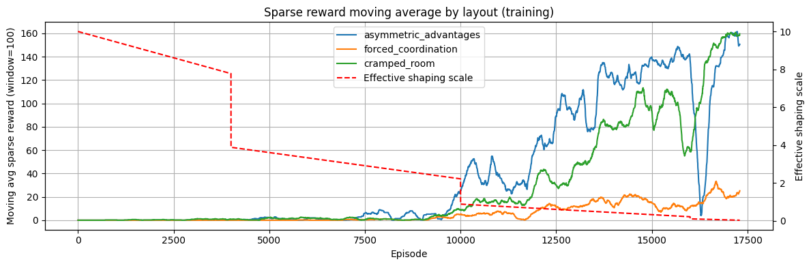

# Experiments on layout generalizaion and reward shaping in Cooperative Multi-Agent Overcooked-AI environment

In this work, we investigate if policies trained via self-play with Proximal Policy
Optimization (PPO) can perfomr e well in multiple layouts and generalize to un-
seen layouts in Overcooked-AI. Our experimental setup combines reward shaping
with a stepwise decay schedule and a deep neural policy architecture. We analyze
the effect of entropy regularization and reward shaping on both learning efficiency
and final policy performance.

You can find the full project report [here](report.pdf).

---

## Example Replay

Below you can see a replay of two agents cooperating in the "cramped_room" layout, from the first experiment of the report:


## Training statistics plot of generalization experiment 



## Setup Instructions

### 1. Clone Overcooked-AI (required dependency)
The Overcooked-AI Python package is needed for all environments and simulation logic.

```bash
git clone https://github.com/HumanCompatibleAI/overcooked_ai.git
cd overcooked_ai
```
### 2. Create and activate a dedicated environment
Recommended to avoid version conflicts.
If you don't use conda, you can use `python3.10 -m venv overcooked-rl`.
```bash
conda create -n overcooked-rl python=3.10 -y
conda activate overcooked-rl
```

### 3. Install Overcooked-AI (with Human-AI RL extras)
The [harl] option installs all dependencies needed for RL experiments (including gym, pygame, etc).
```bash
pip install -e .[harl]
```

### 4. Install Overcooked-RL requirements
This will install all Python dependencies for this repository (TensorFlow, numpy, etc).
```bash
cd path/to/your/overcooked_rl
pip install -r requirements.txt
```
### 5. Run a training script
Run the `demo.ipynb` notebook for evaluating the project model trained with gifs replays.
This includes all the final results discussed in the report.  


### 6. Run a training script

You can run a new training or resume a previus one with PPO using the provided script.
Change script parameters as needed inside `training/train_selfplay.py`.
```bash
cd path/to/your/overcooked_rl
python -m training.train_selfplay
```

```text
overcooked_rl/
│
├── env/
│   └── generalized_env.py          # Multi-layout Gym-like environment wrapper
│
├── cramped_room                    # cramped_room training experiments files (logs, checkpoints, gifs...)
│
├── generalization/                 # Generalization experiments files (logs, chckpoints, gifs...)
|                
├── agents/
│   └── ppo_tf.py                   # Custom PPO agent(TensorFlow implementation)
│
├── training/
│   └── train_selfplay.py           # Main training script (self-play, generalization)
│
├── demo.ipynb                      # Evaluation notebook 
│
├── requirements.txt                # Package requirements
│
└── README.md                       
